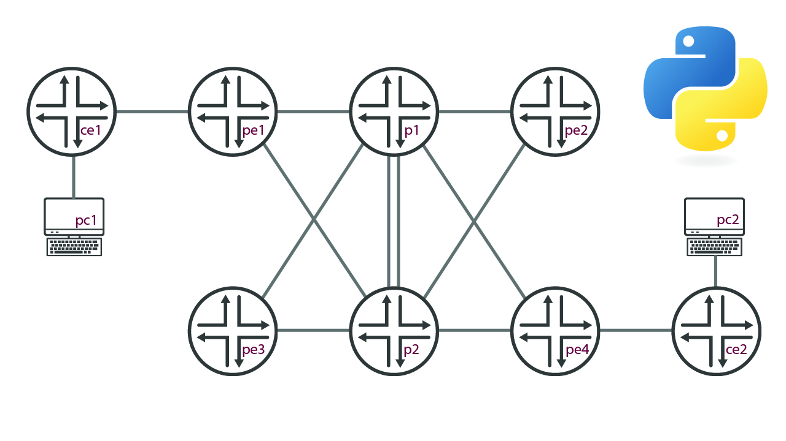

# Juniper MPLS L3VPN demo

Welcome to the repository that manages the for my MPLS L3VPN demo. In this demonstration, we will deploy a L3VPN circuit across an MPLS backbone with Python and Juniper vMX routers

## Topology Used

We are leveraging EVE-NG to deploy an MPLS network on Juniper vMX routers.

